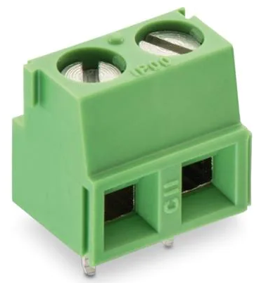

# 1. Connectors

Note:
While generally I won't be recommending that you purchase items from major chinese distributors, these connectors might be one of the exceptions. Buying them from official channels can be very pricy and not worth the money. When searching chinese retail sites use keywords, make sure that you're buying from a reputable dealer, check the comments and perhaps try to be a little conservative with how many amps of current you're trying to push through.

1. Terminal Blocks

    These connectors are a very common way to connect wires with larger current-carrying capacity to your PCB. You can use these wires to either power the PCB with an external PSU or interface the PCB with other tech. They mostly come with 5,00 or 5,08 mm pin spacing with multiple options (such as # of positions, some are pluggable, right angle or straight). The most basic (and thus versatile) is the 5,08 mm 2-position non-pluggable screw terminal such as:

    

    | Name                  | Manufacturer  | Man. part Number  | Octopart Link |
    | -------------         | ------------- | ------------      | ------------- |
    | WR-TBL Series 2135    | Wurth         | 691213510002      | [Link](https://octopart.com/search?q=691213510002&currency=USD&specs=0)

    Suggested quantity to purchase: 50 pcs

    Keywords: terminal block pcb 5.08

    Note:

    Most of these 2-position blocks are stackable and can be joined together. This means that you only need to buy the 2-position ones and you can create larger sets by combining them together.

2. Small signal connectors

    A lot of times you'll need to connect different PCB's together but you won't be expecting to pass through a lot of power (at/below 5V, max 100-200 mA). Most often, this will be the case when you'll be connecting a small sensor board (for example, an acceleration sensor or a digital temperature sensor), most likely something bought from eBay, a GPS module or any other thingamajig, to your main PCB.

    In this case, it's most likely you'll talk to the module with one of the following interfaces:

    * UART  (2 wires)
    * I2C   (2 wires)
    * SPI   (4 wires)

    and you'll also need to provide power and ground (2 wires). We can see that in the worst case scenario we'll need a 6 wire connector and at best you'll need 4.

    I've found that good and ubiqitous choice here is JST PA (or PH) series.

    They have a pretty good balance between size and power capacity and they can be found pretty much everywhere. You can find them both in THT and SMD flavours (choose THT here as they're more robust and easier to route).

    The most universal size i'd reccommend is 6-pole connector. If you want only 1 bag, get those. Otherwise buy one of the many connectors kits available either chinese websites or (better) Amazon.

    Keywords: 2.0 jst-ph

3. But... What about Dupont? Those are awesome, right?

    Well... Yes, but no.

    If you've ever seen an electronics tutorial video you've probably seen a Dupont connector. Those little guys are absolutely perfect for breadbording and connecting to the standard 0.254" pins (which you're going to do A LOT of), but I'm not a big fan of using them on a PCB which is going anywhere outside of your direct line of sight.

    There's nothign wrong with them per-se, but they have a big downside: Dupont connectors are not _lockable_. The only thing keeping them mated is friction, and not much of it at that. Throw in temperature changes, material creep, handling, vibration and all other not-on-the-test-bench situations and you can quickly see why you won't be seeing a Dupont connector in a production device anytime soon.

    Do buy a pack of pre-crimped dupont male-male, female-female and female-male wires, because they'll come in handy duing the development. I'd advise against using them when designing a permanent PCB, though.